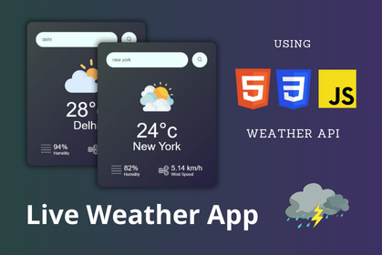

# Weather App



## Introduction

Welcome to the Weather App project! This application provides live weather updates for various cities by leveraging a weather API to fetch real-time weather data. The app displays all the essential weather information, including temperature, humidity, wind speed, and weather conditions.

## Deployment

You can view the deployed project at: [Deployment Link](https://weather-app-project.hafeezbaig.in/)

## Features

- **Live Weather Updates:** Get real-time weather data for any city.
- **Detailed Weather Information:** Displays temperature, humidity, wind speed, and weather conditions.
- **Search Functionality:** Easily search for the weather in different cities.
- **Responsive Design:** The app is designed to work seamlessly on both desktop and mobile devices.

## Prerequisites

Before you get started, make sure you have a modern web browser and an API key from a weather service provider (e.g., OpenWeatherMap).

## Installation

To set up the project on your local machine, follow these steps:

1. **Clone the repository:**

   ```bash
   git clone https://github.com/Hafeezbaig/Weather-App-Project
   cd Weather-App-Project
   ```

2. **Open the project:**

   Open the `index.html` file in your preferred web browser.

3. **Add API Key:**

   - Open the `index.html` file.
   - Replace `'YOUR_API_KEY'` with your actual API key from the weather service provider.

## Running the Project

Simply open the `index.html` file in your browser to start using the Weather App. There are no dependencies or servers required.

## Usage

1. **Search for a City:** Enter the name of a city in the search bar and click the "Search" button.
2. **View Weather Information:** The app will display the current weather details for the specified city.
3. **Refresh Data:** You can search for the weather in multiple cities to get updated information.

## Summary

This project demonstrates a basic implementation of a weather app using HTML, CSS, and JavaScript. It uses a weather API to fetch real-time data and displays comprehensive weather information. This project is an excellent example for beginners looking to learn how to integrate third-party APIs and build responsive web applications.

Feel free to contribute to the project or use it as a reference for your own development needs. For any issues or suggestions, please open an issue in the [GitHub repository](https://github.com/Hafeezbaig/Weather-App-Project/issues).

## Made By

This project is developed by [Hafeez Baig](https://www.hafeezbaig.in).

## Connect

- [Portfolio](https://www.hafeezbaig.in)
- [Connect](https://connect.hafeezbaig.in)

## Socials

- [GitHub](https://github.com/Hafeezbaig)
- [LinkedIn](https://www.linkedin.com/in/mohammed-abdul-hafeez-baig-52b21b209/)
- [Instagram](https://www.instagram.com/mohammed_hafeez_baig/)

## Feedback or Bugs report

- [Talk](https://talk.hafeezbaig.in)